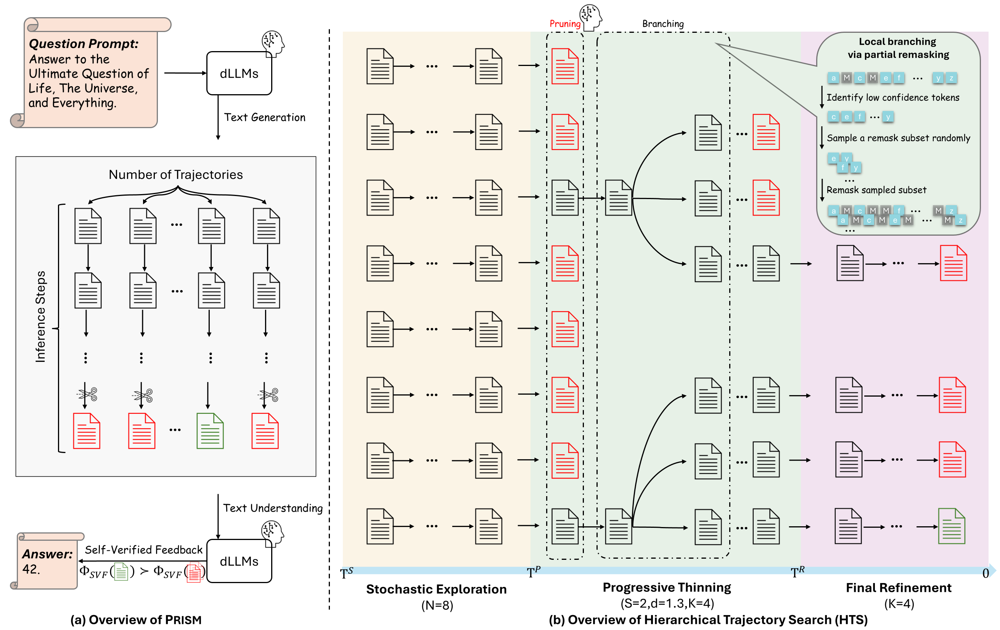
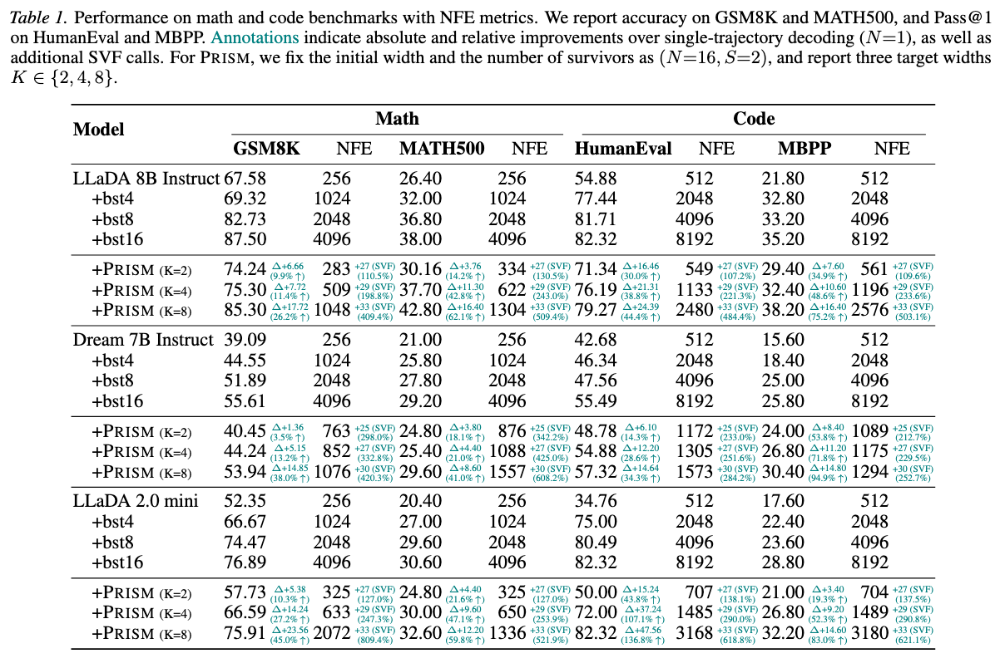

# Prism: Efficient Test-Time Scaling via Hierarchical Search and Self-Verification for Discrete Diffusion Language Models

## PRISM: Pruning, Remasking, and Integrated Self-verification Method

PRISM is an efficient inference framework designed for **Discrete Diffusion Language Models (dLLMs)**, focusing on a favorable performance-efficiency trade-off by matching Best-of-N performance with substantially fewer Function Evaluations (NFE).

[](https://arxiv.org/abs/2602.01842)
[](https://github.com/viiika/Prism)

### Method


### Experiments



### Project Structure

```text
PRISM/
├── Dream/                   # Experiments for Dream
│   ├── Dream_Baseline/      # Standard baseline sampling (N=1)
│   └── Dream_Prism/         # Prism implementation
├── LLaDA/                   # Experiments for LLaDA 8B Instruct
│   ├── LLaDA_Baseline/      # Standard baseline sampling (N=1)
│   ├── LLaDA_Prism/         # PRISM implementation
│   └── LLaDA_Truthfulqa/    # TruthfulQA evaluation
└── LLaDA2mini/              # Experiments for LLaDA 2.0-mini
    ├── LLaDA2mini_Baseline/ # Standard baseline sampling (N=1)
    └── LLaDA2mini_Prism/    # Prism implementation
```

### Prerequisites
```bash
cd PRISM
```
For Dream Project:
```bash
cd Dream/Dream_Prism/eval_instruct
pip install -e .
```
For LLaDA_Truthfulqa:
```bash
cd LLaDA/LLaDA_Truthfulqa/lm-evaluation-harness
pip install -e .
```
For LLaDA and LLaDA2 Projects:
```bash
cd LLaDA/LLaDA_Prism
pip install -r requirements.txt
```
#### Quick Start
Evaluate Dream
```bash
cd Dream/Dream_Prism
bash scripts/run_gsm8k.sh
bash scripts/run_humaneval.sh
bash scripts/run_math500.sh
bash scripts/run_mbpp.sh
```
Evaluate LLaDA 8B Instruct
```bash
cd LLaDA/LLaDA_Prism
bash scripts/run_gsm8k.sh
bash scripts/run_humaneval.sh
bash scripts/run_math500.sh
bash scripts/run_mbpp.sh
```
Evaluate LLaDA 8B Instruct(Truthfulqa)
```bash
cd LLaDA/LLaDA_Truthfulqa
bash scripts/llada_prism.sh
```
Evaluate LLaDA 2.0-mini
```bash
cd LLaDA2mini/LLaDA2mini_Prism
bash scripts/run_gsm8k.sh
bash scripts/run_humaneval.sh
bash scripts/run_math500.sh
bash scripts/run_mbpp.sh
```

### Evaluation & Metrics
Each project folder contains a metrics/ directory used for calculating final accuracy and efficiency metrics.
Usage Example:
```bash
python PRISM/LLaDA/LLaDA_Prism/metrics/gsm8k_all.py
```

### Acknowledgements
This project is built upon [preordinary/LLaDA2](https://github.com/preordinary/LLaDA2), [ML-GSAI/LLaDA](https://github.com/ML-GSAI/LLaDA), [DreamLM/Dream](https://github.com/DreamLM/Dream) and [EleutherAI/lm-evaluation-harness](https://github.com/EleutherAI/lm-evaluation-harness). Special thanks to the authors for their contributions.


### 📚 Citation

If you find this work helpful, please consider citing:

```bibtex
@article{bai2026prism,
  title={Prism: Efficient Test-Time Scaling via Hierarchical Search and Self-Verification for Discrete Diffusion Language Models},
  author={Bai, Jinbin and Li, Yixuan and Zhu, Yuchen and Xin, Yi and Shi, Qingyu and Feng, Aosong and Liu, Xiaohong and Tao, Molei and Xue, Jianru and Li, Xiangtai and Yang, Ming-Hsuan},
  journal={arXiv preprint arXiv:2602.01842},
  year={2026}
}
```

